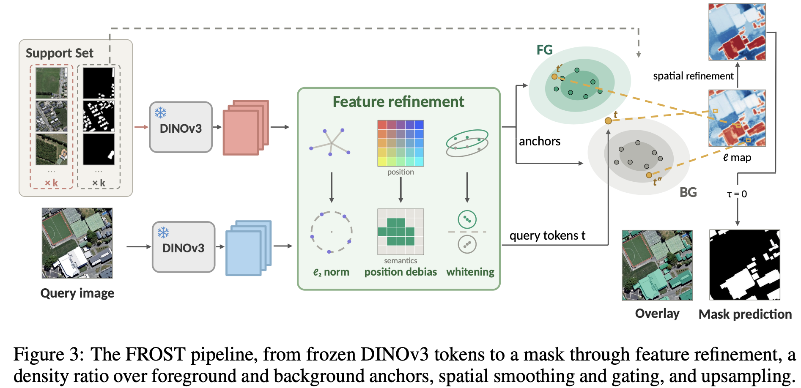
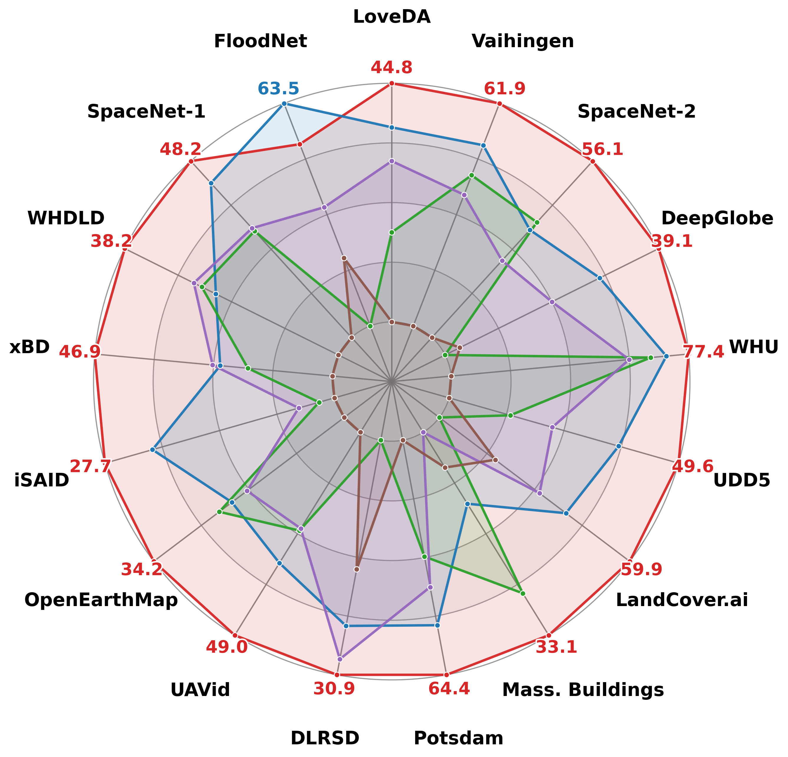
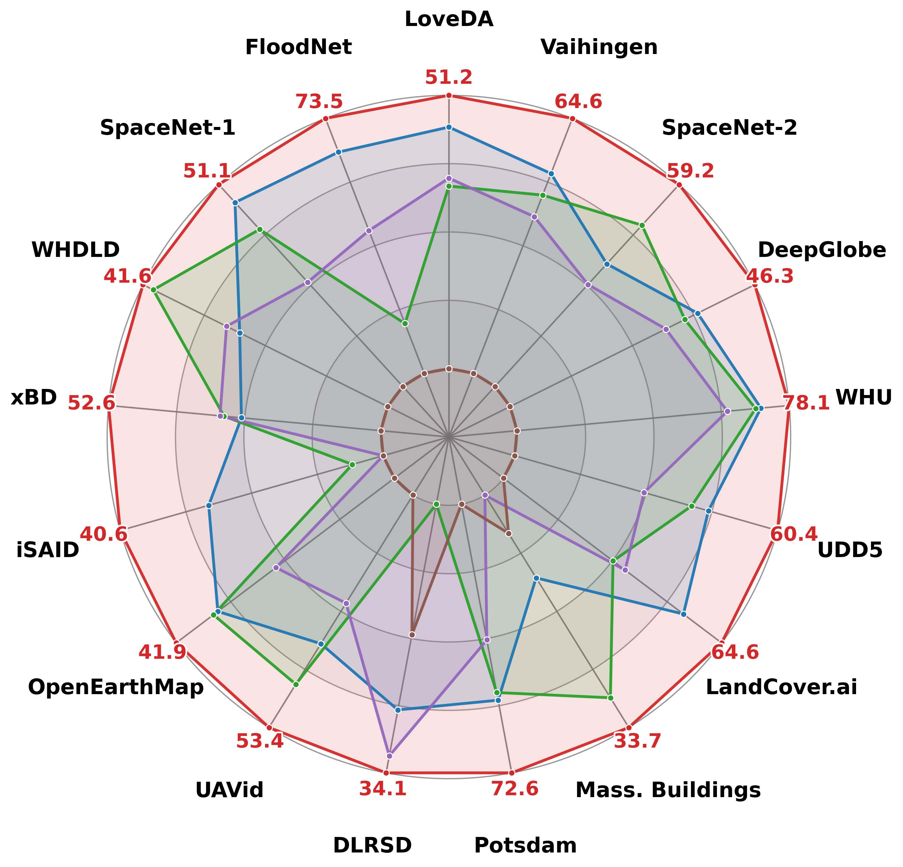
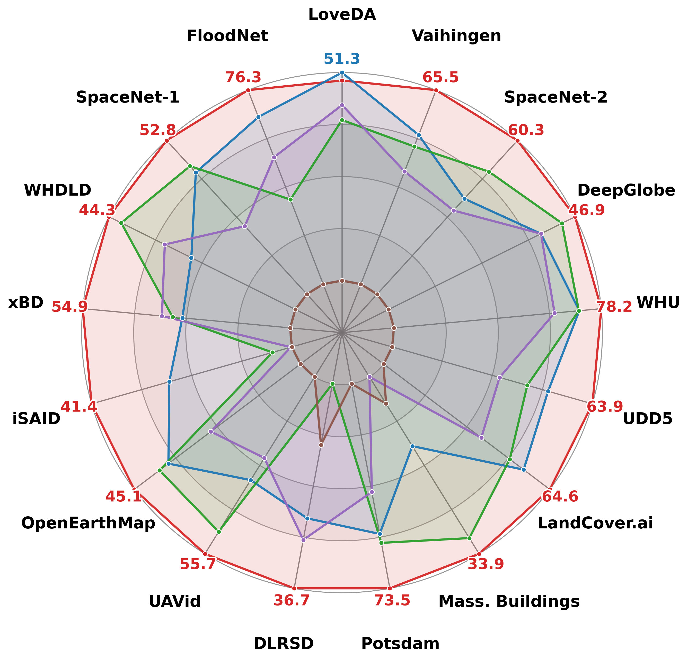
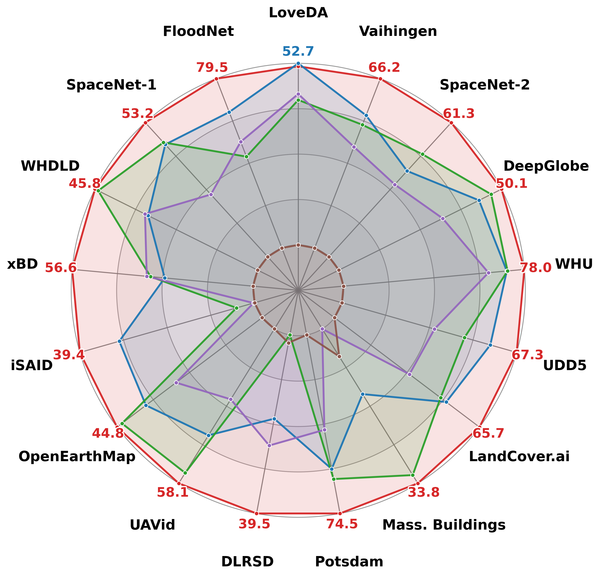

# FROST: Training-Free Few-Shot Segmentation with Frozen Features and Nonparametric Statistics

**Junghwan Park**

> Few-shot segmentation asks a model to delineate a target class in a query image from only a handful of annotated examples, a setting most acute in remote sensing, where labels are scarce and the imagery departs sharply from the natural images on which vision backbones are pretrained. Prevailing approaches either train a segmenter on labelled episodes, which raises accuracy within the training distribution but binds the model to it, or reduce each class to a lossy summary of frozen features, a single prototype, a few cluster prototypes, or a discrete clustering, none of which preserves the internal structure of a multimodal class. We argue that a class is better described by a distribution than by a point, and that frozen self-supervised features already carry enough structure to estimate that distribution directly. We introduce FROST, a training-free few-shot segmenter that treats the reference foreground and background as two point clouds on the unit sphere of frozen DINOv3 features and labels each query token by a nonparametric density ratio, with a threshold the Bayes rule fixes at zero under equal priors. Because the variance of a density estimate shrinks as its sample grows, the decision sharpens as references accumulate, and every remaining quantity from the kernel bandwidth to the spatial gate is read from the support set rather than tuned. We develop FROST for overhead imagery, where a class is typically a scatter of many small and dissimilar instances that a density tracks but a lossy summary blurs. Across seventeen remote-sensing benchmarks FROST surpasses both training-free and learning-based methods, leading by 5.6 mIoU from a single annotated example and widening its lead as the support set grows, all while remaining among the smallest models compared. Code is available at <https://github.com/jhpark-ai/FROST>.

<p align="center"></p>

## Method

FROST performs few-shot (in-context) semantic segmentation **without any
training or learned head**, tuning nothing per dataset. The only neural
component is a **frozen, general-domain DINOv3 ViT-L/16 (LVD-1689M)** backbone,
which maps each 1024×1024 image to a 64×64 grid of patch tokens; everything else
is closed-form, nonparametric statistics over three stages.

1. **Feature refinement.** Tokens are L2-normalized onto the unit sphere, then
   positionally debiased (the shared absolute-position component, estimated from
   a noise image, is projected out), and finally whitened by a
   shrinkage-regularized within-class scatter so the kernel below responds to
   class-discriminative variation. The support is doubled by horizontal
   flipping, and the reference masks split the support tokens into foreground
   and background anchors.
2. **Density-ratio classification.** Each anchor set is treated as a sample from
   a class-conditional density on the unit sphere, estimated with a von
   Mises–Fisher (cosine) kernel whose bandwidth is set by a leave-one-out
   support margin. Each query token is labelled by the log density ratio of
   foreground to background, thresholded at the Bayes-optimal boundary (τ=0)
   under equal priors. The decision sharpens as references accumulate, since the
   variance of the density estimate shrinks as its sample grows.
3. **Spatial refinement.** The per-token score field is smoothed by a bilateral
   propagation that couples feature and colour similarity, restricted by a
   forward (foreground-prototype) and backward (reciprocal-nearest-neighbour)
   candidate gate, then bilinearly upsampled and thresholded at sub-patch
   resolution.

## Install

```bash
pip install -r requirements.txt
```

## Weights

FROST uses the official **DINOv3 ViT-L/16 LVD-1689M** checkpoint from
[facebookresearch/dinov3](https://github.com/facebookresearch/dinov3)
(e.g. `dinov3_vitl16_pretrain_lvd1689m.pth`). The backbone is loaded via
`torch.hub` from that repo.

## Usage

```python
from PIL import Image
from frost import build_frost

model = build_frost("dinov3_vitl16_pretrain_lvd1689m.pth", device="cuda")

# 1-shot
mask = model.segment_one(
    Image.open("ref.jpg").convert("RGB"),
    Image.open("ref_mask.png"),        # nonzero = foreground
    Image.open("query.jpg").convert("RGB"),
)  # -> (H, W) bool tensor

# k-shot: add several references, then segment
model.set_reference(ref1, mask1)
model.set_reference(ref2, mask2)
model.set_target(query)
mask = model.segment()
```

A runnable command-line example is in [`demo.py`](demo.py):

```bash
python demo.py --weights /path/to/dinov3_vitl16_pretrain_lvd1689m.pth \
    --ref-image ref.jpg --ref-mask ref_mask.png --query-image query.jpg --out pred.png
```

## Results

Foreground mIoU on seventeen remote-sensing benchmarks, against training-free
few-shot segmenters, at 1/3/5/10 support shots. FROST (red) leads at every shot
count and widens its margin as the support set grows.


<p align="center">
  
</p>

<table align="center" width="100%">
  <tr>
    <td align="center" width="25%"></td>
    <td align="center" width="25%"></td>
    <td align="center" width="25%"></td>
    <td align="center" width="25%"></td>
  </tr>
  <tr>
    <td align="center"><b>1-shot</b></td>
    <td align="center"><b>3-shot</b></td>
    <td align="center"><b>5-shot</b></td>
    <td align="center"><b>10-shot</b></td>
  </tr>
</table>

## License

This project is released under the [Apache 2.0 License](LICENSE).
